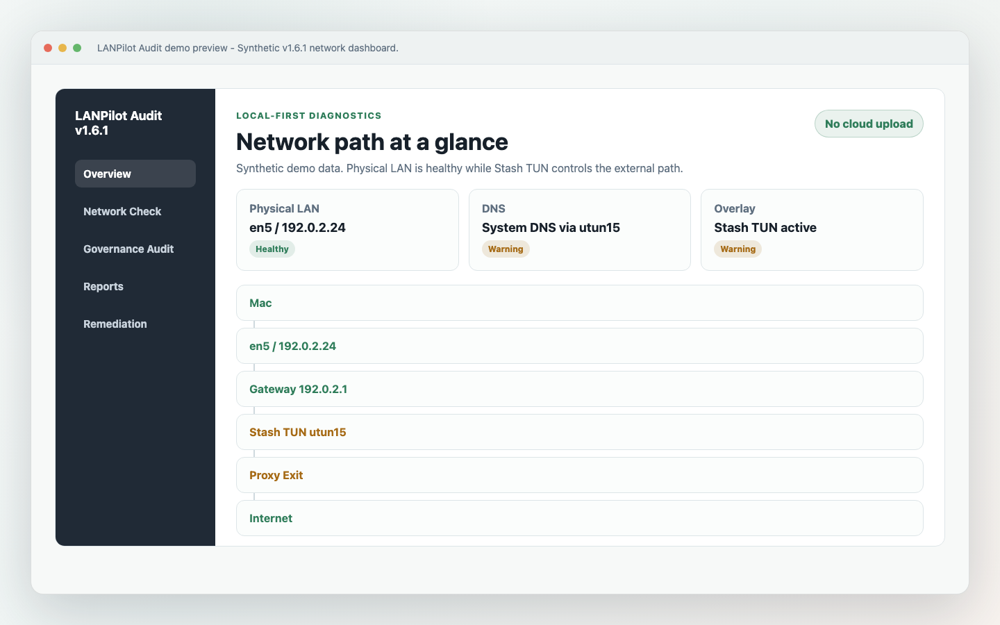
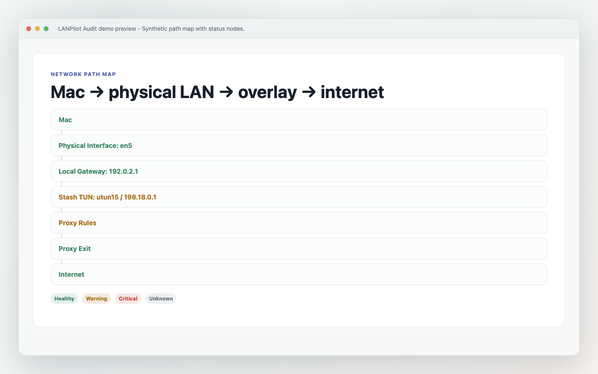
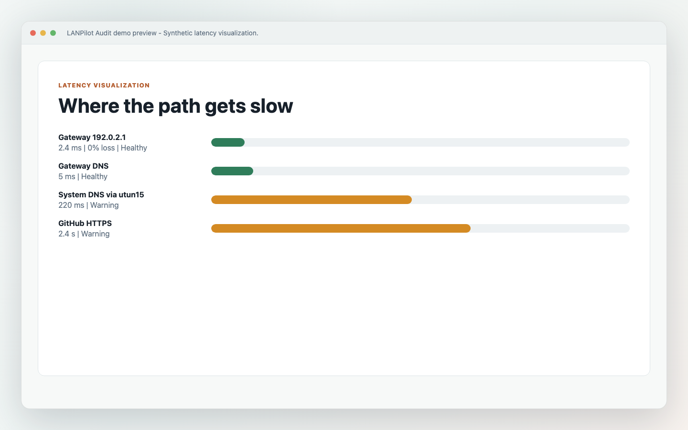
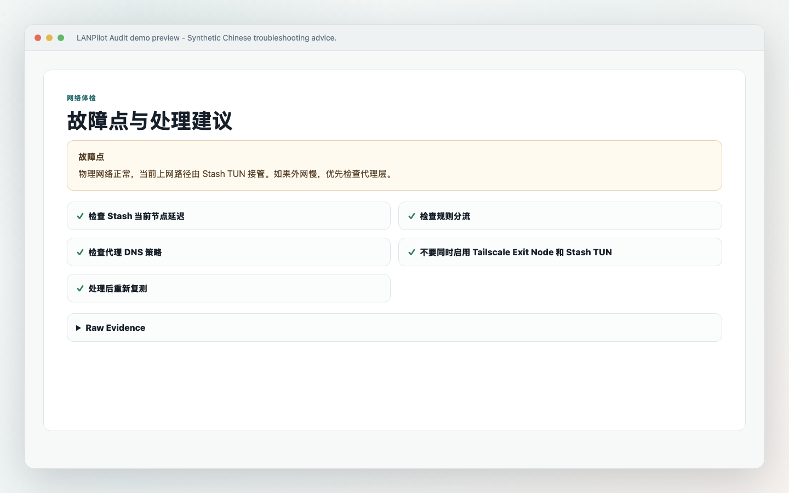
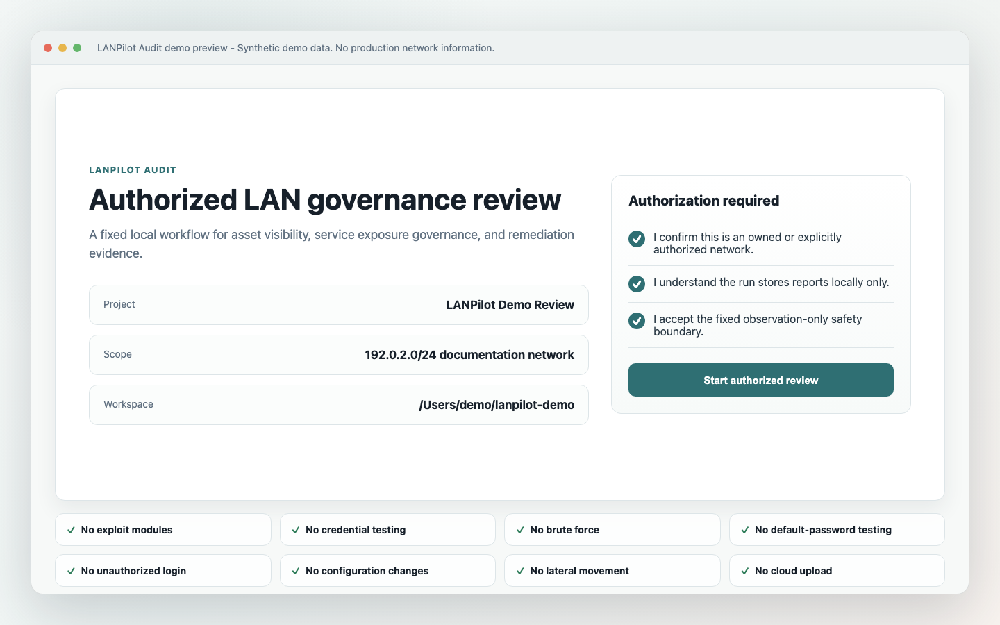
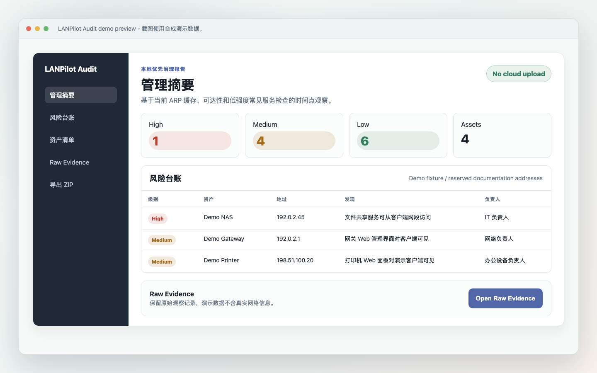
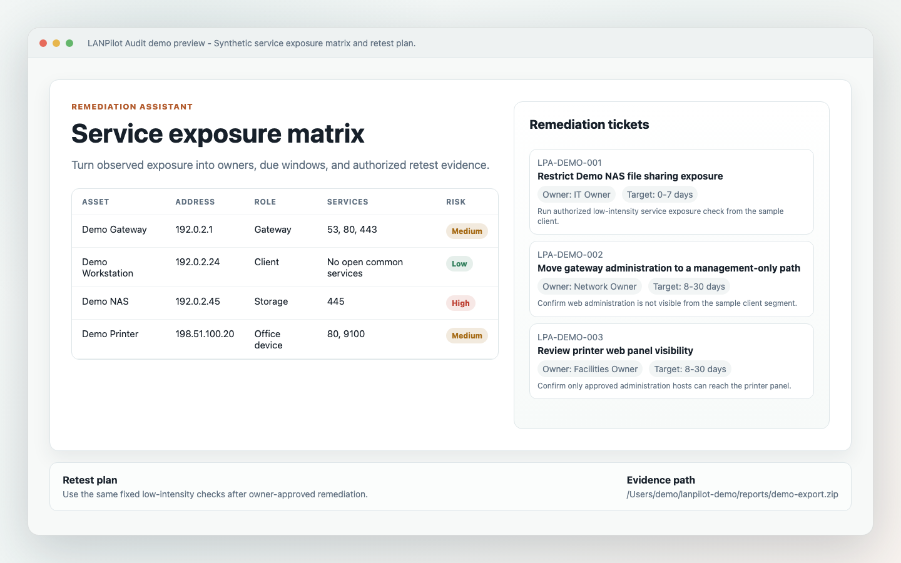

# LANPilot Audit

LANPilot Audit -- Local-first Network Doctor and LAN governance assistant for macOS. Developer ID signed and Apple notarized DMG available in Releases.

[](https://github.com/cqforest123-wq/lanpilot-audit/releases)
[](https://github.com/cqforest123-wq/lanpilot-audit/actions)
[](LICENSE)


LANPilot Audit turns network troubleshooting experience into repeatable, explainable, and retestable local diagnostics. Network Doctor checks the Mac, physical LAN, gateway, DNS, route, overlay/proxy/VPN, TLS, and application path from inside to outside, then ranks likely root causes with evidence, confidence, recommended actions, and a retest plan.

## Visual Preview

Screenshots use synthetic demo data from [docs/assets/demo-data](docs/assets/demo-data/public-demo-audit.json). They do not include production network information.

| Modern dashboard | Network path map | Latency diagnostics | Chinese troubleshooting |
| --- | --- | --- | --- |
|  |  |  |  |

| Authorization workflow | Chinese report view | Remediation workflow |
| --- | --- | --- |
|  |  |  |

## Quick Start

```sh
git clone https://github.com/cqforest123-wq/lanpilot-audit.git
cd lanpilot-audit
npm install
npm run check
npm run tauri -- dev
```

You can also use `npm run app:dev` for the local Tauri development run.

## Why

Small teams often lose hours separating Wi-Fi, DHCP, DNS, proxy/VPN, TLS, and application symptoms. LANPilot Network Doctor provides a fixed diagnostic graph and root-cause ranking before moving into the broader governance workflow for assets, exposure, remediation, and retest records.

## Safety Boundary

**LANPilot Audit is for networks you own or are explicitly authorized to assess.**

- No exploit modules.
- No credential testing.
- No brute force.
- No default-password testing.
- No unauthorized login.
- No configuration changes.
- No lateral movement.
- No cloud upload of audit evidence.

## Features

- Network Doctor with Quick Check and Deep Diagnosis modes.
- Diagnostic domains for local host, physical interface, Wi-Fi, DHCP, gateway, DNS, route, overlay/proxy/VPN, TCP, UDP/QUIC, TLS, external path, application endpoint, router health, and unknown cases.
- Diagnosis graph with nodes, edges, status, metrics, evidence, and confidence.
- Root-cause candidates with probability, confidence, supporting evidence, counter-evidence, recommended actions, and retest plan.
- Health scores for Physical LAN, Wi-Fi, Gateway, DNS, Overlay / Proxy, External Path, and Application Access.
- Modern dashboard for network path, DNS, overlay, fault point, and troubleshooting advice.
- Network Path Map for physical, Stash TUN, and Tailscale Exit Node scenarios.
- Latency visualization for gateway, DNS, TCP, TLS, TTFB, and HTTPS total timing.
- Network Interface Selector that keeps physical and overlay interfaces distinct.
- Authorized audit workflow with explicit scope confirmation.
- Local-first engine and local report storage.
- Asset inventory and service exposure matrix.
- Local network configuration observation.
- Bonjour / mDNS observation.
- Web/TLS baseline for already-discovered web services.
- Snapshot comparison across local audit runs.
- Remediation Assistant with fixed local artifacts and authorized retest entry.
- Multilingual UI for 11 locales.
- zh-CN UI completeness checks for visible product copy.
- Raw Evidence preservation for audit traceability.
- Export ZIP, HTML, Markdown, CSV, and JSON outputs.
- Developer ID signed and Apple notarized DMG release path.

## Download

Download the Developer ID signed and Apple notarized DMG from [LANPilot Audit v1.6.0](https://github.com/cqforest123-wq/lanpilot-audit/releases/tag/v1.6.0):

- [LANPilot-Audit_1.6.0_aarch64.dmg](https://github.com/cqforest123-wq/lanpilot-audit/releases/download/v1.6.0/LANPilot-Audit_1.6.0_aarch64.dmg)
- [SHA256SUMS.txt](https://github.com/cqforest123-wq/lanpilot-audit/releases/download/v1.6.0/SHA256SUMS.txt)

Verify the SHA-256 checksum before opening the DMG:

```sh
shasum -a 256 -c SHA256SUMS.txt
```

The v1.6.0 DMG is Developer ID signed, Apple notarized, stapled, and Gatekeeper accepted.

## Build From Source

```sh
npm install
npm run check
npm run app:build
npm run tauri -- dev
```

Useful release and readiness commands:

```sh
npm run public:check
npm run release:verify
npm run gatekeeper:check
```

## Architecture

- Tauri desktop shell.
- React and TypeScript frontend.
- Rust backend commands with fixed inputs.
- Bundled local audit engine with deterministic SHA-256 manifest.
- Fixed, allowlisted audit steps.
- No arbitrary shell command input.

## Roadmap

- Public docs site.
- Signed auto-update research.
- Mac App Store Lite research.
- Policy templates for common small-business findings.
- Team workflow for assignment, acceptance, and retest.

## Contributing

Safe contributions are welcome. Please read [CONTRIBUTING.md](CONTRIBUTING.md), [SECURITY.md](SECURITY.md), and the pull request template before proposing changes.

Contributions that add offensive modules, credential testing, arbitrary shell command execution, unauthorized login, or automatic configuration changes are out of scope.

If LANPilot Audit helps your network governance workflow, please consider starring the project.
